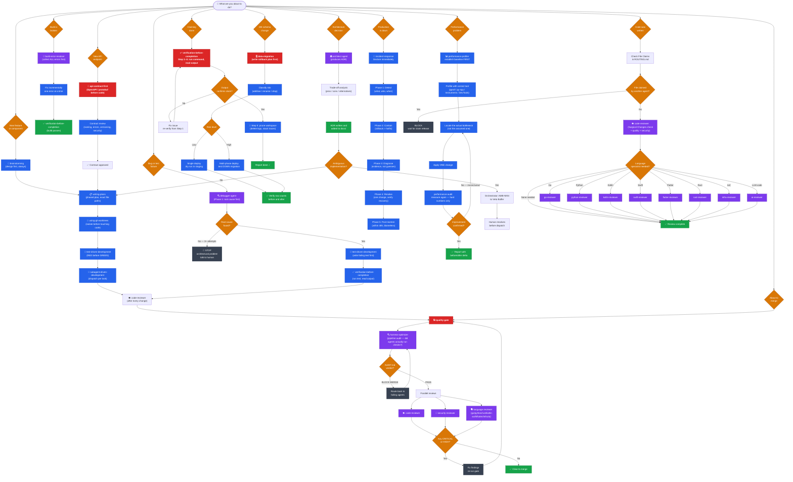

# A Team — Decision Tree

> **How to read this:** Start at the top. Follow the arrow that matches your situation. Every node is mandatory — you cannot skip a gate.

---

## Quick Reference — Mandatory Sequences

| Situation | Required sequence |
|-----------|------------------|
| New feature | `brainstorming` → `writing-plans` → `using-git-worktrees` → `TDD` → `subagent-driven-dev` → `code-reviewer` → `/quality-gate` |
| Bug fix | `debugger` (Phase 1) → `TDD` → `verification-before-completion` → `code-reviewer` |
| New API | `api-contract-first` (contract approved) → `writing-plans` → implement |
| DB change | `data-migration` (rollback plan) → staging dry-run → verify row counts |
| Claiming done | `verification-before-completion` Steps 1–5 (run + read + prune) |
| Any merge | `harness-optimizer` → `/quality-gate` → all clear |
| Production down | `incident-response` phases 1–5 → post-mortem |
| Performance issue | `performance-profiler` (baseline) → profile → 1 change → `performance-audit` (measure) |
