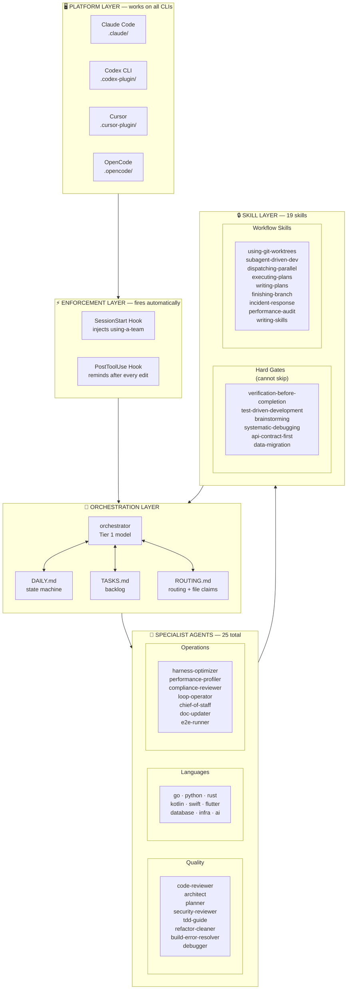
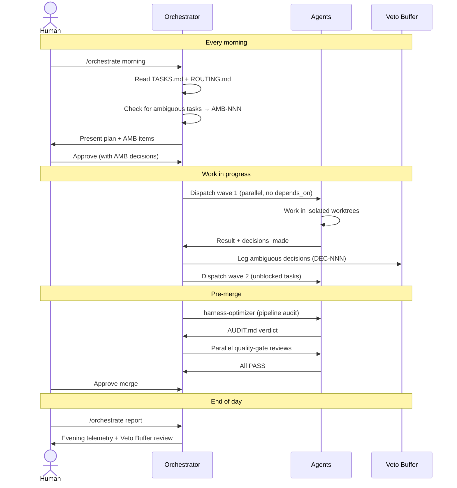
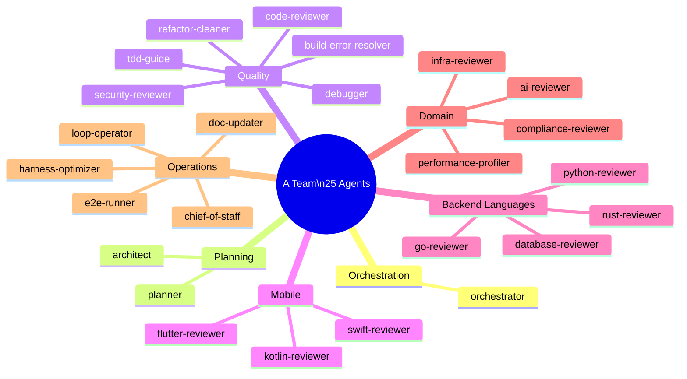
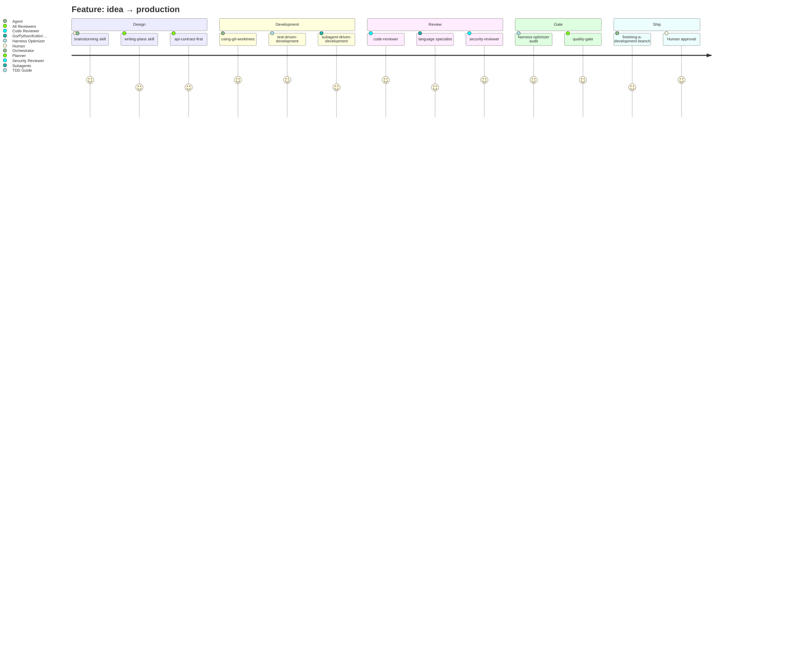

# A Team — Overview

> Drop this folder into any project. Get an immediately operational team of specialists with zero configuration drift.

---

## What A Team is

A Team is a **portable multi-agent infrastructure** for AI coding assistants. It works with any model — Claude, GPT-4o, Gemini, or others — through any supported platform. It turns a single general-purpose model into a coordinated team of specialists — each with a defined role, tool access, and quality gate — that enforces the same engineering standards on every project it's deployed to.

```
Without A Team                        With A Team
─────────────────────────────────     ─────────────────────────────────────
One model                             25 specialist agents
Does everything                       Each has one responsibility
No enforcement                        Hard gates that can't be bypassed
Forgets standards between sessions    Standards re-injected every session
Manual routing                        Orchestrator dispatches automatically
No audit trail                        DAILY.md + Veto Buffer + AUDIT.md
```

---

## Architecture — 5 Layers



---

## The Daily Cycle



---

## The 25 Agents at a Glance



---

## How a Feature Gets Built



---

## Installation — 3 Steps

```bash
# 1. Copy infrastructure into your project
cp -r "A Team/.claude"  your-project/
cp -r "A Team/skills"   your-project/
cp -r "A Team/hooks"    your-project/

# 2. Declare your project scope
cp "A Team/INIT_TEMPLATE.md" your-project/INIT.md
# edit INIT.md — languages, stack, compliance scope, CLI(s)

# 3. Initialize — orchestrator prunes irrelevant agents automatically
/orchestrate init
```

After init: `.agent-sync/TEAM.md` lists what's active. Everything else is pruned.

---

## Key Design Principles

| Principle | How A Team implements it |
|-----------|-------------------------|
| **Stateless** | Every agent reads from files; no memory between sessions |
| **Prunable** | Orchestrator removes irrelevant agents at init; lean by default |
| **Portable** | Works on Claude Code, Codex, Cursor, OpenCode — same files |
| **Enforceable** | Hard gates via hooks; skills injected every session |
| **Auditable** | DAILY.md, Veto Buffer, AUDIT.md — full trail of decisions |
| **Surgical** | Every agent has a single responsibility; no scope creep |
| **Parallel** | Independent tasks dispatched simultaneously; worktrees prevent collision |

---

## What Gets Pruned (example: Python API project)

```
Active after /orchestrate init          Pruned
─────────────────────────────────       ──────────────────────────
orchestrator                            go-reviewer
architect                               rust-reviewer
planner                                 kotlin-reviewer
code-reviewer                           swift-reviewer
security-reviewer                       flutter-reviewer
tdd-guide                               e2e-runner (if E2E = no)
debugger                                chief-of-staff (if no comms tools)
build-error-resolver                    loop-operator (if no auto loops)
python-reviewer        ←── kept
database-reviewer      ←── kept (PostgreSQL declared)
infra-reviewer         ←── kept (Docker declared)
compliance-reviewer    ←── kept (GDPR declared)
harness-optimizer
performance-profiler
```

The team that runs is the team the project needs. Nothing more.
